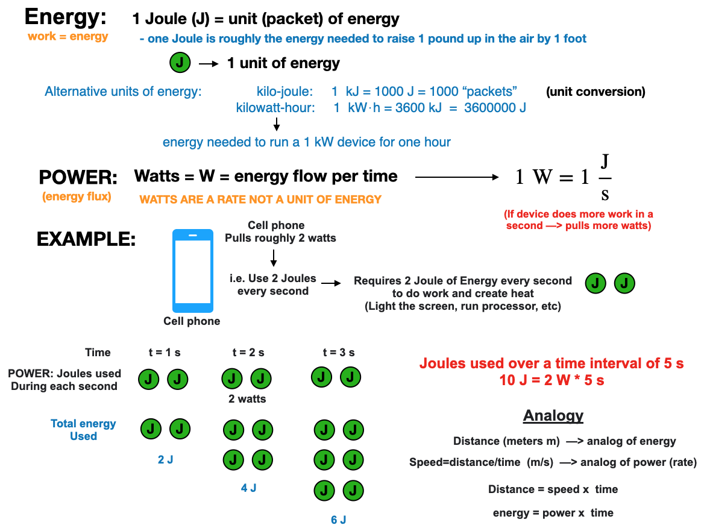

# Homework: Interactive client-side visualizations

## Overview

For this assignment, you will explore the issues involved in implementing interactive and animated visualizations. You will build a visualization that enables interactive exploration and storytelling.

**This assignment has two goals:** 

(1) We want you to gain familiarity implementing interaction and animation techniques for visualizations; 

(2) We want you to think carefully about the *effectiveness* of specific interaction and animation techniques for real world datasets.

> This is an open ended assignment, the more you are creative and demonstrate critical thinking ...  the better. 

Focus on designing a limited yet compelling visualization that enables interactive exploration along a few critical dimensions, and then layer on additional complexity.  A tightly-focused, well-implemented interactive graphic is much preferred to a sprawling design that attempts too much! 

## Data

This assignment will be based on a subset of the Electricity Consumption and Occupancy (ECO) data set, available as a `.zip` in the Google-Drive folder for this assignment. 

Data from three households are provided, comprising  power consumption overall (from smart meters) and particular plugs/appliances per second over a period of time. For the smart meter data, the primary interest is the variable `powerallphases` which is the sum of real power over all power phases consumed in the household. The plugs data provides appliance-level consumption. 

At the beginning, state clearly the question(s) you want to address with your graphics. There are many dimensions to explore, so don't necessarily restrict yourself to a simple time-series of a variable, which is obvious. 

**Note on units**:  The SI units for energy and time are Joules (J) and seconds (s) respectively. The units of power (energy/time) in the data-set are Watts (W=J/S). However, total energy consumption is typically measured in kWh (kilo-watt hours). Where kWh is a measure of energy (1 kW⋅h = 3600 kJ = 3600000 J).  Be aware of this, an do any appropriate unit conversions needed for your analysis. (see provided image for additional details). 

> Since the units are seconds, the variables simplify in this case, however, you should ALWAYS think about your units and make sure you understand what you are measuring or analyzing.

## Instructions 

**You should do the entire assignment in a single notebook** (`.qmd` or `.ipynb`, it is up to you)

You will need to design at least **THREE** interactive graphics, with any necessary animation techniques, to explore or understand a compelling question from the data set below, **BE CREATIVE ABOUT YOUR VISUALIZATIONS**.  It is up to you which plotting library to use out of the following choices `Plotly.py` (i.e. the wrapper for `plotly.js` in python), `Altair` OR `Vega/Vega-Lite`, OR `Bokeh`, OR a combination of each.  In order to determine what subset of the data and which interactive options are most promising, we encourage you to perform additional exploratory analysis. What aspects of the data reveal the most interesting discoveries or stories? Do not feel obligated to try to convey *everything* about the data: focus on a compelling subset.

Your graphic must include interactions and animations that enable exploration or storytelling. Possible techniques include panning, zooming, brushing, details-on-demand (e.g., tooltips), dynamic query filters, and selecting different measures to display. You are free to also consider highlights, annotations, or other narrative features intended to draw attention to particular items of interest and provide additional context.

*As always, we expect you to go above and beyond and make a truly excellent final product that you would be proud sharing with anyone.*

Implement your graphic save it as HTML files.  Your graphic should not require customized server-side support.

**You MUST use Quarto:**  

* Create your narrative, code, and visualizations in a quarto document (either `HW-2.ipynb` or `HW-2.qmd` )
  * *Optional*: If using `.qmd` you can compartmentalize your work in sub-files, e.g. `EDA.qmd` and then use `include` commands inside your `HW-2.qmd` file (e.g. `<< include EDA.qmd >>`). 
* At the end, export this to a file named `HW-2.html` 
* The final `html ` document, should be a flowing narrative, including text, interactive visualizations, with code accessible via code-folding, **all resources should be embedded so the HTML file is fully self contained.**
* **Code language**
  * You can use either `R` or `Python` for your plots and analysis (or a mix of both), although `Python` is recommended.
    * If you are using `R` and `Python` simultaneously , then you will need to figure out how to navigate issues associated with having both languages active in the same file. This isn't complicated and there is documentation regarding this online.
    * Your Plotly visualizations MUST go further than simple `plotly-express` examples. You should increase the complexity well beyond simple 5 to 10 line code visualizations. Refer to the `Plotly lab` for inspiration regarding the expected level of complexity.
  * In either case, you MUST use (1) `code-folding=true` (2) `embed-resources=true `
    * i.e. your final HTML must be fully self contained 
    * See the lecture slides for information on embedding html plots in Quarto documents 

**What to include in the notebook** 

Your write-up should include:

+  **Data section**: Briefly describe the data and which portions are most relevant for your questions.  
+  **Data-science questions**:  Introduce the question(s) you're trying to answer with each visualization. We will consider the nature of the questions and whether you're successful in answering them through your visualizations
+ **Data preparation and EDA:** Include any code (with code-folding) used to transform the data to meet your needs. Also, include textual narration to describe what you are doing and why. 
+ **Results section** 
  + **A rationale for your design decisions.** How did you choose your particular visual encodings, interaction, and animation techniques? What alternatives did you consider and how did you arrive at your ultimate choices?
  + **Visualizations**: Include the final products for your visualizations 
+ **References**: Remember to acknowledge all appropriate sources not just in your write-up but also directly on your visualization itself (including the source of your data, and any example visualization you drew inspiration from).

**Code**: Include the code used throughout the work as needed in the notebook, however, obscure it with code folding so the narrative is not interrupted. 

> **This is personal work, and not meant to be done in groups. We expect to see individualism in the submissions, including customized themes and presentations, interactions and animations (if you use them)**

> **Please read the instructions carefully, particularly with regard to the files required.**

## Submission details

*When you are completed you MUST submit the following to Canvas*

* The final `HW-2.html`  document, created with Quarto, as described above
* Your Canvas submission will mark the time-stamp for your submission used for late penalty calculation.  

## Additional expectations 

**Going beyond the "call of duty" generally merits full credit, for example:**

+ advanced interaction or animation techniques 
+ novel visualization elements
+ effective multi-view coordination
+ thoughtful and elegant graphic design
+ insightful & engaging exploration or narrative experience
+ **Theming**: Is the overall product ascetically well designed, with a unified custom theme shared across graphs.
+ **Code styling:** All code files should be properly formatted and styled using tools introduced in the previous assignment.

**Point deductions will occur from, but are not limit to, the following issues:**

+ errors or broken features
+ clearly ineffective visual encodings or poor visual design
+ lack of exploratory or narrative interaction or animation techniques
+ overly simplistic or distracting interaction or animation techniques
+ confusing interface design
+ incomplete or insufficient write-up
+ This is a non-exhaustive list, other issues associated with poor visualization, presentation, writing, or coding will also lead to point deductions